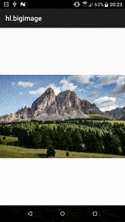

Axway Hyperloop example using SubsamplingScaleImageView (<https://github.com/davemorrissey/subsampling-scale-image-view>) on Android to load large images (with automatic zoom and pan)



```javascript
var f = Ti.Filesystem.getFile(Ti.Filesystem.resourcesDirectory, "filename"); // get the image from /app/assets/
var bigimage = require("/bigimage");

bigimage.setImage(f.nativePath);    // set the image path
$.index.add(bigimage.getView());
$.index.open();
```

Photo by Luca Bravo on Unsplash: <https://unsplash.com/photos/lWAOc0UuJ-A>
